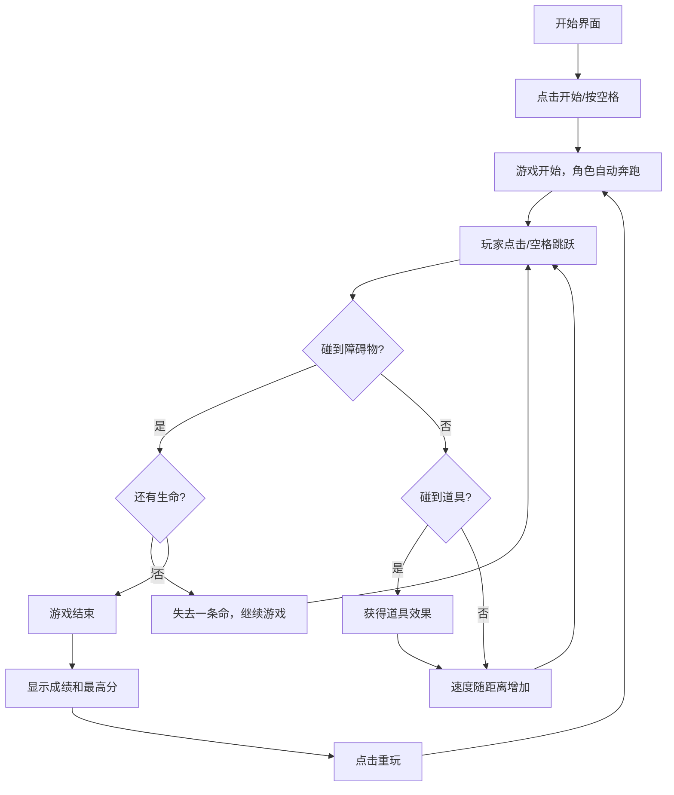

## 1. 产品概述

一款像素风格的无尽跑酷小游戏，玩家控制戴着鸭舌帽的跑者在清晨的城市公园中奔跑，灵活躲避障碍物，收集道具获得增益效果。

- 核心玩法：角色自动向前奔跑，玩家通过点击或空格键控制跳跃躲避障碍物
- 目标用户：休闲游戏爱好者，支持 PC 和移动端
- 产品价值：提供轻松有趣的碎片化娱乐体验，复古像素风格唤起怀旧情怀

## 2. 核心功能

### 2.1 功能模块

1. **开始界面**：游戏标题、开始按钮、操作说明、历史最高分显示
2. **游戏主界面**：跑者角色、滚动背景、障碍物、道具、距离计数、生命值显示
3. **结束界面**：本次距离、历史最高分、重新开始按钮

### 2.2 页面详情

| 页面名称 | 模块名称 | 功能描述 |
|---------|---------|---------|
| 开始界面 | 标题区域 | 显示游戏名称和像素风格Logo |
| 开始界面 | 操作说明 | 展示操作方式（空格键/点击跳跃） |
| 开始界面 | 最高分显示 | 展示历史最佳成绩 |
| 开始界面 | 开始按钮 | 点击进入游戏 |
| 游戏界面 | 角色控制 | 跑者自动奔跑，响应跳跃操作 |
| 游戏界面 | 背景滚动 | 天空、树木、地面多层视差滚动 |
| 游戏界面 | 障碍物系统 | 随机生成矿泉水瓶、护栏、小狗三种障碍物 |
| 游戏界面 | 道具系统 | 运动鞋（短暂加速）、运动手表（加一条命） |
| 游戏界面 | 难度递增 | 随距离增加速度加快，障碍物频率提高 |
| 游戏界面 | HUD显示 | 实时距离、生命值、加速状态 |
| 结束界面 | 成绩展示 | 本次距离、历史最高分 |
| 结束界面 | 重玩按钮 | 点击重新开始游戏 |

## 3. 核心流程

玩家打开游戏 → 显示开始界面（展示最高分）→ 点击开始或按空格键 → 角色自动向前奔跑 → 玩家点击/按空格跳跃躲避障碍物 → 收集道具获得增益 → 撞到障碍物失去生命 → 生命耗尽游戏结束 → 显示成绩 → 点击重玩重新开始

## 4. 用户界面设计

### 4.1 设计风格

- **主色调**：天空蓝 (#87CEEB)、草地绿 (#90EE90)、像素棕 (#8B4513)、暖黄 (#FFD700)
- **辅色调**：像素红 (#FF6B6B)、像素蓝 (#4ECDC4)、像素紫 (#9B59B6)
- **像素风格**：16x16 像素网格，复古游戏配色，无抗锯齿
- **字体**：使用像素风格字体（Press Start 2P）
- **按钮风格**：像素边框，点击有按压反馈动画
- **图标**：全部使用像素艺术风格绘制

### 4.2 页面设计概览

| 页面名称 | 模块名称 | UI元素 |
|---------|---------|---------|
| 开始界面 | 标题区域 | 大号像素字体游戏名，鸭舌帽跑者像素画，闪烁动画 |
| 开始界面 | 背景 | 静态公园背景，阳光斑驳效果 |
| 开始界面 | 按钮 | 像素风格"开始游戏"按钮，悬停放大效果 |
| 游戏界面 | 背景 | 三层视差滚动（远景树木、中景灌木、近景地面） |
| 游戏界面 | 角色 | 4帧跑步动画，跳跃帧，落地烟尘效果 |
| 游戏界面 | 障碍物 | 矿泉水瓶、护栏、小狗像素精灵 |
| 游戏界面 | 道具 | 运动鞋闪烁动画，运动手表旋转动画 |
| 游戏界面 | HUD | 左上角距离计数，右上角生命值心形图标 |
| 结束界面 | 弹窗 | 半透明黑色背景，像素边框成绩面板 |
| 结束界面 | 成绩 | 大号数字显示距离，"新纪录"提示动画 |

### 4.3 响应式设计

- **桌面端**：游戏画布 800x450，键盘空格键/鼠标点击跳跃
- **移动端**：游戏画布自适应屏幕宽度，触摸屏幕任意位置跳跃
- **布局**：游戏始终居中显示，保持 16:9 宽高比
- **触摸优化**：增加触摸响应区域，无延迟响应

### 4.4 动效设计

- **角色跑步**：4帧循环动画，每帧间隔 100ms
- **跳跃动画**：起跳帧 → 滞空帧 → 下落帧 → 落地帧，总时长 600ms
- **落地反馈**：落地时产生像素烟尘粒子效果
- **道具收集**：收集时道具消失，产生金色粒子四散效果
- **受伤反馈**：角色闪烁红色，屏幕轻微震动
- **加速效果**：角色身后产生拖尾残影，速度线特效
- **背景滚动**：不同层以不同速度移动，营造深度感
