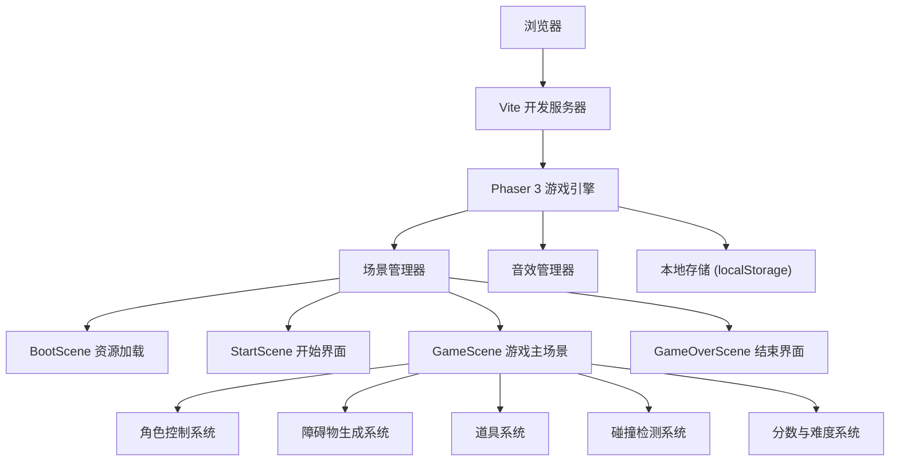

## 1. 架构设计



## 2. 技术描述

- **前端**：TypeScript + Vite + Phaser 3
- **初始化工具**：Vite (vanilla-ts 模板)
- **后端**：无（纯前端游戏）
- **数据存储**：localStorage 存储历史最高分
- **资源生成**：使用 Phaser Graphics API 动态生成像素精灵，无需外部图片资源
- **音频**：使用 Web Audio API 动态生成 8-bit 风格音效，无需外部音频文件

## 3. 技术选型理由

| 技术 | 选型理由 |
|-----|---------|
| Phaser 3 | 成熟的 HTML5 游戏引擎，内置物理引擎、动画系统、碰撞检测，完美支持 2D 像素游戏 |
| TypeScript | 提供类型安全，减少运行时错误，提升代码可维护性 |
| Vite | 极速开发体验，热更新，构建速度快 |
| 代码生成像素资源 | 无需外部素材，减少依赖，所有像素艺术通过代码动态生成 |
| Web Audio API 生成音效 | 程序生成 8-bit 音效，无需音频文件，加载速度快 |
| localStorage | 轻量级本地存储，保存最高分无需后端 |

## 4. 项目结构

```
src/
├── scenes/
│   ├── BootScene.ts        # 资源预加载场景
│   ├── StartScene.ts       # 开始界面场景
│   ├── GameScene.ts        # 游戏主场景
│   └── GameOverScene.ts    # 结束界面场景
├── game/
│   ├── Player.ts           # 玩家角色类
│   ├── Obstacle.ts         # 障碍物类
│   ├── PowerUp.ts          # 道具类
│   ├── Ground.ts           # 地面和背景类
│   └── GameConfig.ts       # 游戏配置常量
├── utils/
│   ├── PixelArt.ts         # 像素艺术生成器
│   ├── SoundManager.ts     # 8-bit 音效管理器
│   └── Storage.ts          # 本地存储工具
├── main.ts                 # 游戏入口
└── style.css               # 全局样式
```

## 5. 核心类与接口定义

### 5.1 游戏配置

```typescript
// src/game/GameConfig.ts
export const GameConfig = {
  WIDTH: 800,
  HEIGHT: 450,
  GRAVITY: 800,
  JUMP_FORCE: -350,
  INITIAL_SPEED: 300,
  MAX_SPEED: 700,
  SPEED_INCREMENT: 5,
  INITIAL_OBSTACLE_INTERVAL: 2000,
  MIN_OBSTACLE_INTERVAL: 800,
  PLAYER_X: 100,
  GROUND_Y: 380,
  INITIAL_LIVES: 3,
  POWERUP_SHOE_DURATION: 5000,
  POWERUP_SPAWN_CHANCE: 0.15,
} as const;

export interface GameState {
  score: number;
  highScore: number;
  lives: number;
  speed: number;
  isBoost: boolean;
  isGameOver: boolean;
  isPaused: boolean;
}
```

### 5.2 玩家类

```typescript
// src/game/Player.ts
export class Player extends Phaser.Physics.Arcade.Sprite {
  private isJumping: boolean;
  private isInvincible: boolean;
  private animFrame: number;
  private jumpTween: Phaser.Tweens.Tween | null;
  
  constructor(scene: Phaser.Scene, x: number, y: number);
  jump(): void;
  update(time: number, delta: number): void;
  takeDamage(): boolean;
  setInvincible(duration: number): void;
  playRunAnimation(): void;
  playJumpAnimation(): void;
  createLandingDust(): void;
}
```

### 5.3 障碍物类型

```typescript
// src/game/Obstacle.ts
export type ObstacleType = 'bottle' | 'fence' | 'dog';

export interface ObstacleConfig {
  type: ObstacleType;
  width: number;
  height: number;
  jumpForce: number; // 需要的跳跃力
}

export const OBSTACLE_CONFIGS: Record<ObstacleType, ObstacleConfig> = {
  bottle: { type: 'bottle', width: 20, height: 32, jumpForce: 280 },
  fence: { type: 'fence', width: 48, height: 40, jumpForce: 320 },
  dog: { type: 'dog', width: 40, height: 28, jumpForce: 300 },
};
```

### 5.4 道具类型

```typescript
// src/game/PowerUp.ts
export type PowerUpType = 'shoe' | 'watch';

export interface PowerUpConfig {
  type: PowerUpType;
  width: number;
  height: number;
  color: number;
}

export const POWERUP_CONFIGS: Record<PowerUpType, PowerUpConfig> = {
  shoe: { type: 'shoe', width: 24, height: 20, color: 0xff6b6b },
  watch: { type: 'watch', width: 22, height: 22, color: 0x4ecdc4 },
};
```

## 6. 像素资源生成方案

使用 Phaser Graphics API 和 Canvas API 动态生成所有像素精灵，无需外部图片资源：

```typescript
// src/utils/PixelArt.ts
export class PixelArt {
  static generatePlayer(scene: Phaser.Scene): void;
  static generateObstacle(scene: Phaser.Scene, type: ObstacleType): void;
  static generatePowerUp(scene: Phaser.Scene, type: PowerUpType): void;
  static generateBackground(scene: Phaser.Scene): void;
  static generateGround(scene: Phaser.Scene): void;
  
  private static drawPixel(
    ctx: CanvasRenderingContext2D,
    x: number,
    y: number,
    color: string,
    size: number = 1
  ): void;
}
```

## 7. 音效生成方案

使用 Web Audio API 动态生成 8-bit 风格音效：

```typescript
// src/utils/SoundManager.ts
export class SoundManager {
  private audioContext: AudioContext;
  
  constructor();
  playJump(): void; // 方波上升音调
  playPickup(): void; // 三角波快速上升
  playHurt(): void; // 锯齿波下降
  playGameOver(): void; // 下降音阶
  startBGM(): void; // 循环 8-bit 背景音乐
  stopBGM(): void;
  setVolume(volume: number): void;
  
  private playTone(
    frequency: number,
    duration: number,
    type: OscillatorType,
    volume: number = 0.1
  ): void;
}
```

## 8. 游戏主循环逻辑

```
每一帧执行：
1. 更新游戏速度（根据距离递增）
2. 移动所有障碍物和道具
3. 检测玩家与障碍物碰撞
4. 检测玩家与道具碰撞
5. 更新玩家动画状态
6. 滚动背景图层
7. 更新分数显示
8. 生成新的障碍物（达到间隔时间时）
9. 生成新的道具（随机概率）
```

## 9. 碰撞检测策略

使用 Phaser Arcade Physics：
- 玩家与障碍物：矩形碰撞盒，检测重叠
- 玩家与道具：圆形碰撞盒，收集判定
- 玩家与地面：重力和地面检测，控制跳跃状态
- 无敌状态：受伤后短暂无敌，忽略碰撞

## 10. 性能优化

- **对象池**：障碍物和道具使用对象池复用，避免频繁创建销毁
- **离屏销毁**：对象移出屏幕左侧后回收到对象池
- **粒子限制**：粒子效果数量限制，自动销毁过期粒子
- **像素渲染**：使用 Phaser 像素模式 `pixelArt: true`，禁用抗锯齿
- **FPS 节流**：移动端自动调整渲染帧率
